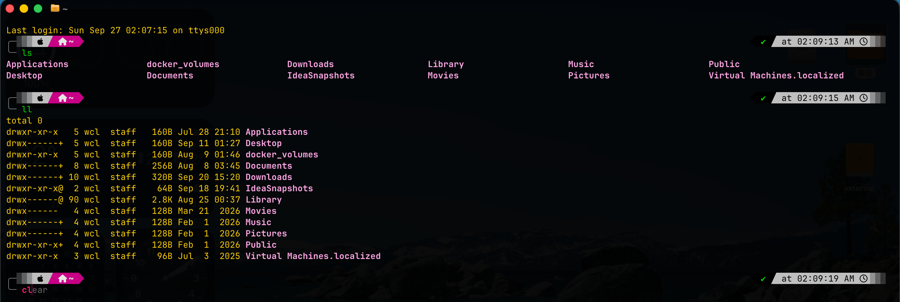
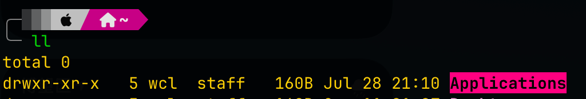

# yello-pink
A high-contrast yellow and pink color scheme designed for [Ghostty](https://ghostty.org/).  
专为 Ghostty 打造的高对比度黄粉主题配色。
## 📸 Preview / 效果预览

| Terminal Preview | Selection Style |
| :---: | :---: |
|  |  |

---
QuickStart/快速开始
1. install ghostty (if not installed)
```
brew install --cask ghostty
```
2. create themes folder
```
mkdir -p ~/.config/ghostty/themes
```
3. download themes file
```
curl -fsSL [https://raw.githubusercontent.com/AraraglKoyomi/yello-pink/main/themes/yellow-pink](https://raw.githubusercontent.com/AraraglKoyomi/yello-pink/main/themes/yellow-pink) -o ~/.config/ghostty/themes/yellow-pink
```
4. modify config
```
cd ~
cd .config/ghostty
echo "theme = yellow-pink" >> config
```

Tips: recommanded using oh-my-zsh for a better experience :)